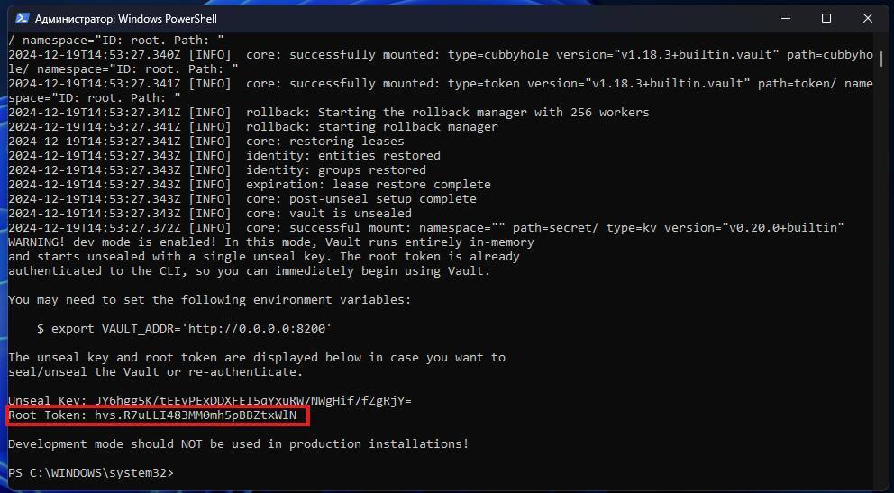
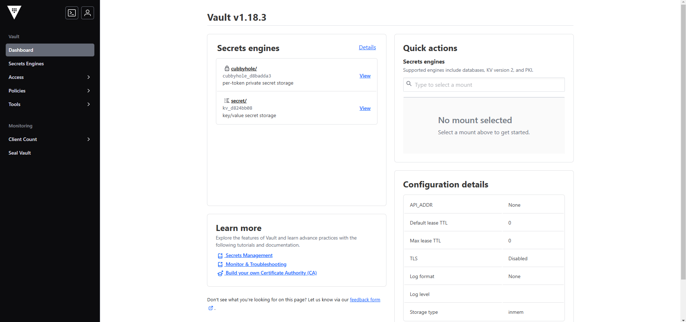
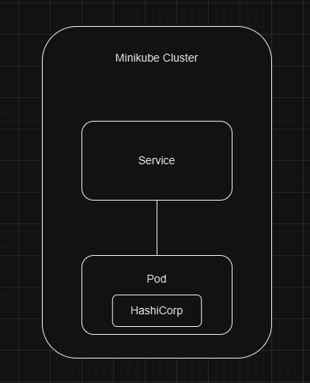

University: [ITMO University](https://itmo.ru/ru/)
Faculty: [FICT](https://fict.itmo.ru)
Course: [Introduction to distributed technologies](https://github.com/itmo-ict-faculty/introduction-to-distributed-technologies)
Year: 2024/2025
Group: K4112c
Author: Logvinov Lev Anatolievich
Lab: Lab1
Date of create: 15.12.2024
Date of finished: 15.12.2024

# Ход работы

По инструкциям из официальных документаций были установлены Docker и Minikube. Далее был загружен образ HashiCorp Vault.

Создан манифест для развертывания пода с образом HashiCorp Vault. 
```yaml
apiVersion: v1
kind: Pod
metadata:
  name: vault
  namespace: default
  labels:
    app: vault
spec:
  containers:
  - name: vault-container
    image: hashicorp/vault:latest
    ports:
    - containerPort: 8200
      name:  http
```
Загружена полученная конфигурация с помощью команды:
```bash
minikube kubectl -- apply -f myfirst.yaml
```

Создан сервис для доступа к контейнеру с помощью команды:
```bash
minikube kubectl -- expose pod vault --type=NodePort --port=8200
```

Осуществлен проброс портов с помощью команды:
```bash
minikube kubectl -- port-forward service/vault 8200:8200
```

По адресу http://localhost:8200 был осуществлен доступ в vault. Токен для авторизации можно найти в логах vault, для этого выполнена команда:
```bash
minikube kubectl logs vault
```


Вход выполнен.


### Схема организации контейнеров и сервисов


### Вопросы:
1. Что сейчас произошло и что сделали команды указанные ранее?
Команды указанные ранее помогли развернуть Minikube Cluster и 
Pod, который запускает контейнер с образом HashiCorp Vault, который слушает на порту 8200. 
Далее был создан сервис типа NodePort, маршрутизирующий сетевые запросы, поступающие на порт 8200, в Pod на порт 8200. 
Настроено перенаправление сетевого трафика с порта 8200 локального компьютера в сервис на порт 8200

2. Где взять токен для входа в Vault?
В логах пода. Для этого нужно выполнить команду minikube kubectl logs vault.