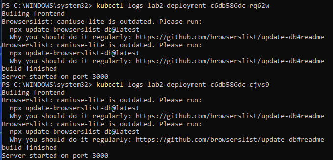

University: [ITMO University](https://itmo.ru/ru/)
Faculty: [FICT](https://fict.itmo.ru)
Course: [Introduction to distributed technologies](https://github.com/itmo-ict-faculty/introduction-to-distributed-technologies)
Year: 2024/2025
Group: K4112c
Author: Logvinov Lev Anatolievich
Lab: Lab2
Date of create: 20.09.2024
Date of finished: 31.09.2024

# Ход работы

Создан конфигурационный файл, в котором задано количество replicas = 2, а также образ image и переменные окружения env. Deployment создает 2 реплики приложения itdt-contained-frontend. В шаблоне пода указаны переменные окружения REACT_APP_USERNAME = Lev Logvinov и REACT_APP_COMPANY_NAME = llogvinov.

```yaml
apiVersion: apps/v1
kind: Deployment
metadata:
  name: lab2-deployment
spec:
  replicas: 2
  selector:
    matchLabels:
      app: lab2-deployment
  template:
    metadata:
      labels:
        app: lab2-deployment
    spec:
      containers:
      - name: deployment
        image: ifilyaninitmo/itdt-contained-frontend:master
        ports:
        - containerPort: 3000
        env:
          - name: REACT_APP_USERNAME
            value: Lev Logvinov
          - name: REACT_APP_COMPANY_NAME
            value: llogvinov
```

Был применен файл конфигураций и проверены созданные deployments.


Был создан сервис доступный внутри кластера с помощью команды:
```bash
minikube kubectl -- expose deployment deployment --port=3000 --name=service --type=ClusterIP
```

Для проброса порта была выполнена команда:
```bash
minikube kubectl -- port-forward service/service 3000:3000
```

Были проверены созданные поды и сервисы с помощью команд:
```bash
minikube kubectl -- get pods
minikube kubectl -- get services
```


Переходим по адресу http://localhost:3000 и смотрим результат. Переменные REACT_APP_USERNAME, REACT_APP_COMPANY_NAME не меняются с обновлением страницы, так как env переменные не различаются между репликами. Переменная Container name изменяется так как для каждой реплики генерируется автоматически уникальное имя.


Были проверены логи контейнеров с помощью команд:
```bash
kubectl logs lab2-deployment-c6db586dc-rq62w
kubectl logs lab2-deployment-c6db586dc-cjvs9
```



### Схема организации контейнеров и сервисов
