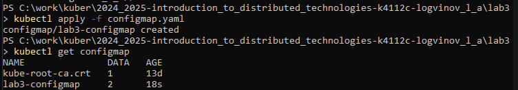
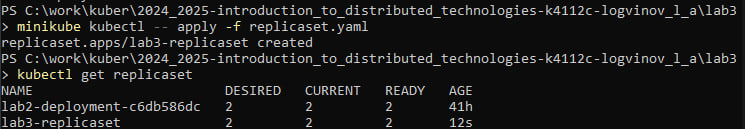
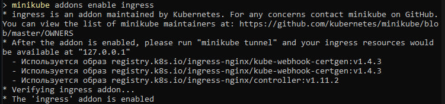
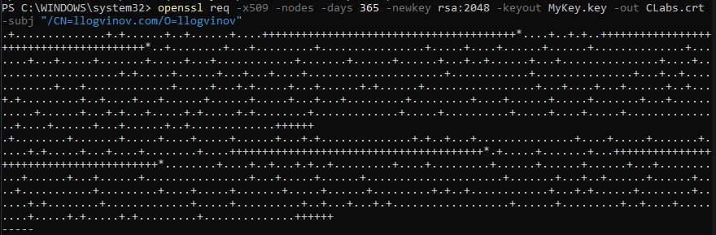
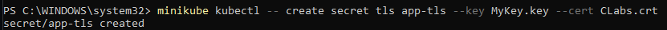
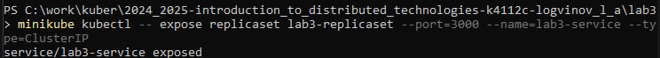
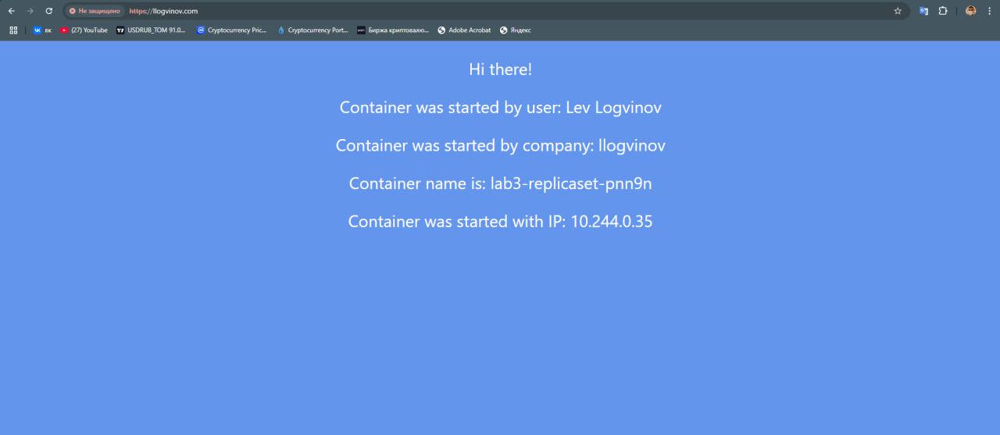
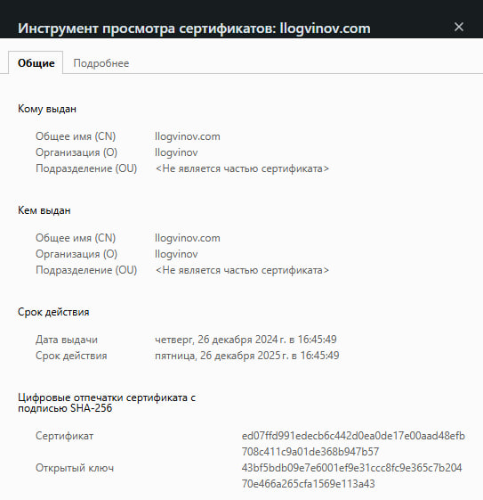
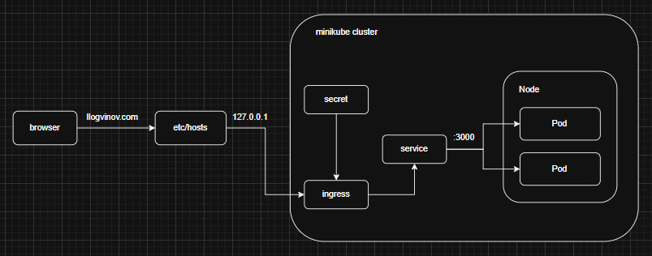

University: [ITMO University](https://itmo.ru/ru/)
Faculty: [FICT](https://fict.itmo.ru)
Course: [Introduction to distributed technologies](https://github.com/itmo-ict-faculty/introduction-to-distributed-technologies)
Year: 2024/2025
Group: K4112c
Author: Logvinov Lev Anatolievich
Lab: Lab3
Date of create: 20.09.2024
Date of finished: 31.09.2024

# Ход работы

Создан конфигурационный файл, в котором задано `REACT_APP_USERNAME` = Lev Logvinov и `REACT_APP_COMPANY_NAME` = llogvinov.
```yaml
apiVersion: v1
kind: ConfigMap
metadata:
  name: lab3-configmap
data:
  REACT_APP_USERNAME: "Lev Logvinov"
  REACT_APP_COMPANY_NAME: "llogvinov"
```

Был применен файл конфигураций и проверено создание configmap:



Создан ReplicaSet с 2 репликами контейнера ifilyaninitmo/itdt-contained-frontend. Также в конце указан ранние созданый объект `lab3-configmap`, который содержит переменные среды:
```yaml
apiVersion: apps/v1
kind: ReplicaSet
metadata:
  name: lab3-replicaset
spec:
  replicas: 2
  selector:
    matchLabels:
      app: lab3-app
  template:
    metadata:
      labels:
        app: lab3-app
    spec:
      containers:
        - name: lab3-app
          image: ifilyaninitmo/itdt-contained-frontend:master
          ports:
          - containerPort: 3000
          envFrom:
            - configMapRef:
                name: lab3-configmap
```

Был применен файл конфигураций и проверено создание replicaset:



**Ingress** - это объект Kubernetes, который управляет внешним доступом к сервисам внутри кластера, он позволяет направлять запросы к нужным сервисам на основе правил.

Основные функции:
- Маршрутизация трафика
- Обработка SSL/TLS.
- Балансировка нагрузки.

Был включен ingress:



После выполнения применена команда `minikube tunnel`

**TLS-сертификат** - это цифровой сертификат, используемый для шифрования соединений между клиентами и серверами, обеспечивая защиту передаваемых данных. TLS-сертификат помогает удостоверить подлинность сайта или сервиса, гарантируя пользователям, что их данные передаются безопасно. В Kubernetes TLS-сертификаты часто применяются вместе с Ingress для организации HTTPS-соединений, обеспечивая безопасное подключение к сервисам внутри кластера. Для этого, чтобы шифровать трафик, сертификаты добавляются в кластер Kubernetes в виде secret-ов и привязываются к Ingress ресурсам.

Был установлен OpenSSL. Создан TLS-сертификат, с помощью команды:



В результате создается самоподписанный сертификат `CLabs.crt` и соответствующий ему закрытый ключ `MyKey.key`, привязанный к домену `llogvinov.com`.

Импортируем данный сертификат в Kubernetes, как объект `secret`:



Создан сервис для доступа к replicaset



Создан объект Ingress, который использует сервис приложения и секрет с TLS-сертификатом:

```yaml
apiVersion: networking.k8s.io/v1
kind: Ingress
metadata:
  name: lab3-ingress
spec:
  tls:
  - hosts:
    - llogvinov.com
    secretName: app-tls
  rules:
  - host: llogvinov.com
    http:
      paths:
      - path: /
        pathType: Prefix
        backend:
          service:
            name: lab3-service
            port:
              number: 3000
```

После создания сервиса и конфигурационного файла создан объект Ingress:
```bash
minikube kubectl -- apply -f ingress.yaml
```

В конфигурационном файле `hosts`, расположенном по пути `C:\Windows\System32\drivers\etc` добавлена конфигурация:
```bash
127.0.0.1 llogvinov.com
```

Переходим по адресу `llogvinov.com` и смотрим результат:



Был проверен сертификат:



### Схема организации контейнеров и сервисов
