University: [ITMO University](https://itmo.ru/ru/)
Faculty: [FICT](https://fict.itmo.ru)
Course: [Introduction to distributed technologies](https://github.com/itmo-ict-faculty/introduction-to-distributed-technologies)
Year: 2024/2025
Group: K4112c
Author: Logvinov Lev Anatolievich
Lab: Lab4
Date of create: 20.09.2024
Date of finished: 31.09.2024

При запуске Minikube установлен плагин CNI=calico. Мы указываем, что minikube должен использовать стандарт CNI для управления сетями в кластере Kubernetes, в качестве сетевого плагина CNI использовать calico. Также, что создаются две рабочие ноды:

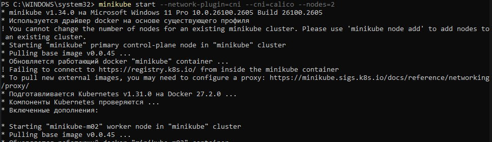

Далее добавим ноду в кластер и проверим:

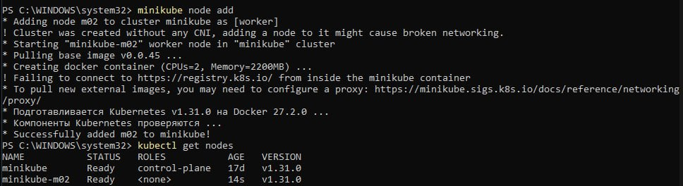

Установим calicoctl:

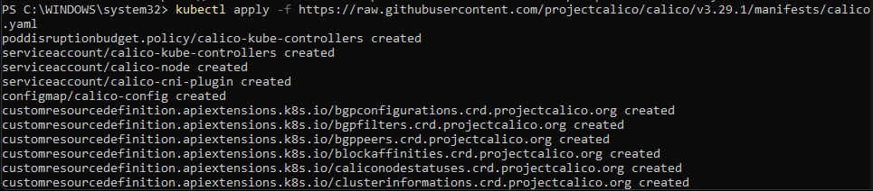

Для проверки работы CNI Calico проверим количество подов с меткой calico-node:

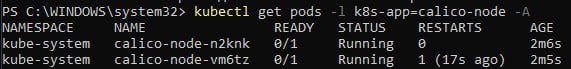

Назначим лейблы нодам на основании их условного георграфического расположения и проверим:

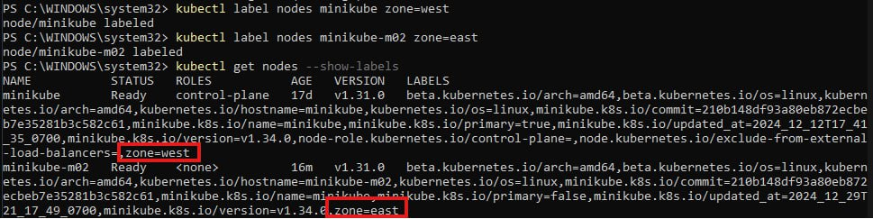

Проверим и удалим установленные по умолчанию ip-пулы:

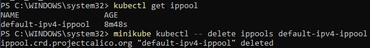

Теперь создадим манифесты, которые будут назначать IP-адреса подам из пулов, указанных в манифесте, на основании заданного лэйбла:

```yaml
apiVersion: crd.projectcalico.org/v1
kind: IPPool
metadata:
  name: zone-east
spec:
  cidr: 192.168.2.0/24
  ipipMode: Always
  natOutgoing: true
  nodeSelector: zone == "east"
```

```yaml
apiVersion: crd.projectcalico.org/v1
kind: IPPool
metadata:
  name: zone-west
spec:
  cidr: 192.168.1.0/24
  ipipMode: Always
  natOutgoing: true
  nodeSelector: zone == "west"
```

Применим манифесты:

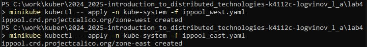

Проверим IP-пулы:

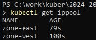

Создадим манифест для deployment:

```yaml
apiVersion: apps/v1
kind: Deployment
metadata:
  name: lab4-deployment
spec:
  replicas: 2
  selector:
    matchLabels:
      app: lab4-deployment
  template:
    metadata:
      labels:
        app: lab4-deployment
    spec:
      containers:
        - name: frontend
          image: ifilyaninitmo/itdt-contained-frontend:master
          ports:
          - containerPort: 3000
          env:
            - name: REACT_APP_USERNAME
              value: "Lev Logvinov"
            - name: REACT_APP_COMPANY_NAME
              value: "llogvinov"
```

Применим его:

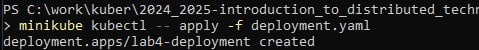

Для создания сервиса выполним команду:

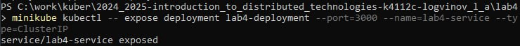

Пробросим порты командой:

```bash
minikube kubectl -- port-forward service/lab4-service 3000:3000
```
Перейдем на localhost:3000 и проверим результат:

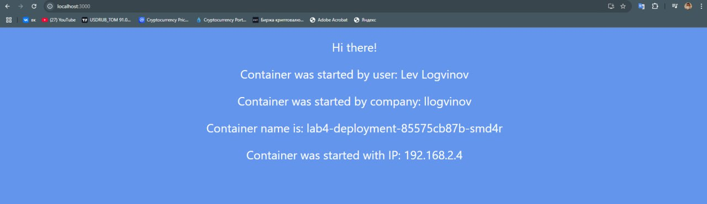

Как можно видеть, поду был присвоен адрес из пула, который был задан ранее. В данном случае подключение произошло к ноде с меткой zone=east.

Выведем IP-адреса подов, с помощью команды:

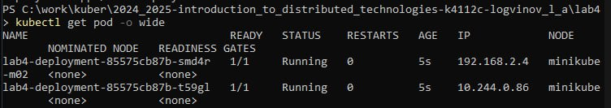

Затем подключимся к каждому из подов и проверим доступность другого пода с помощью команды ping:

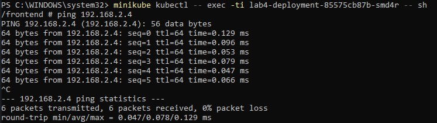

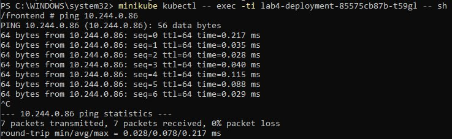

### Схема организации контейнеров и сервисов
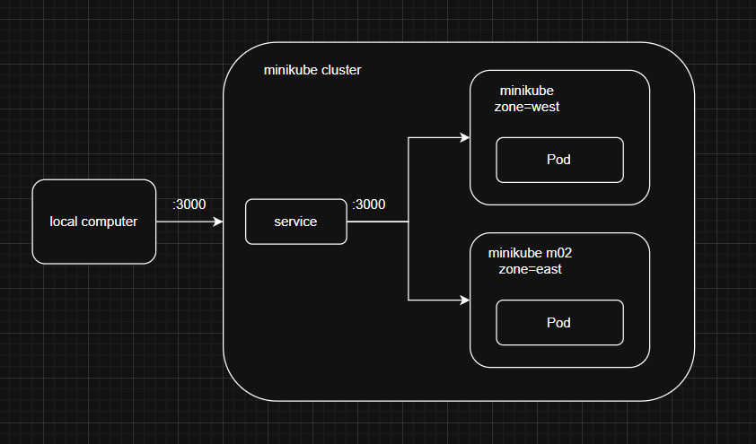